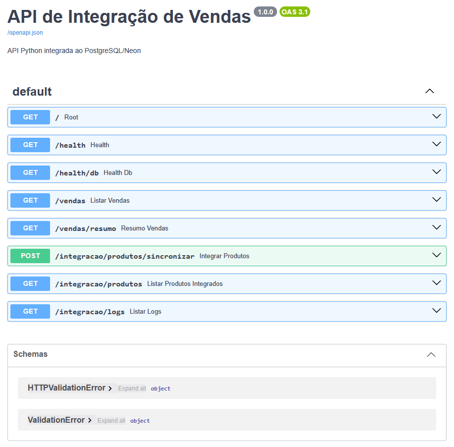

# 🚀 API de Integração Python

Projeto online e funcional - API REST com integração externa, PostgreSQL/Neon e automação via GitHub Actions.


Projeto desenvolvido em **Python com FastAPI** para demonstrar uma integração REST completa entre uma **API externa**, uma aplicação Python e um banco de dados **PostgreSQL hospedado no Neon**.

A aplicação realiza o consumo de dados externos, tratamento das informações, persistência no banco, atualização de registros existentes, controle de duplicidade, paginação e registro das execuções da integração.

O projeto também está publicado na internet utilizando **Render** e possui documentação interativa através do **Swagger/OpenAPI**.

---

## 🌐 API Online

**URL da API:**

```text
https://api-integracao-python.onrender.com
```

**Swagger / documentação interativa:**

```text
https://api-integracao-python.onrender.com/docs
```


### Swagger / Documentação da API
```
<p align="center">

  
</p>

```

### Fluxo principal da integração

```text
API Externa
     ↓
HTTP GET
     ↓
Python / httpx
     ↓
Recebimento do JSON
     ↓
Tratamento dos dados
     ↓
Verificação do registro
     ↓
INSERT ou UPDATE
     ↓
PostgreSQL / Neon
     ↓
Registro da execução
     ↓
API FastAPI
     ↓
Swagger
```

---

# 🎯 Objetivos do projeto

O projeto foi desenvolvido para demonstrar conhecimentos práticos em:

* Desenvolvimento de APIs REST com Python
* FastAPI
* Consumo de APIs externas
* Manipulação de JSON
* Paginação de APIs
* Integração com PostgreSQL
* SQLAlchemy
* INSERT e UPDATE
* Controle de duplicidade
* Upsert com `ON CONFLICT`
* Tratamento de erros
* Logs de integração
* Variáveis de ambiente
* Git e GitHub
* Automação com GitHub Actions
* Deploy em ambiente cloud
* Documentação com Swagger/OpenAPI

---

# 🔄 Integração com API externa

A aplicação utiliza a **DummyJSON** como API externa de demonstração.

Endpoint utilizado:

```text
https://dummyjson.com/products
```

Os produtos são recebidos em formato JSON e posteriormente tratados pelo Python.

Exemplo simplificado:

```json
{
  "id": 1,
  "title": "Produto exemplo",
  "category": "categoria",
  "brand": "marca",
  "price": 99.99,
  "stock": 50
}
```

---

# 🗄️ Banco de dados

O projeto utiliza **PostgreSQL hospedado no Neon**.

Foram utilizadas duas estruturas principais para a integração.

### `integracao_produtos`

Tabela responsável por armazenar os dados recebidos da API externa.

Principais campos:

```text
id
api_id
nome_produto
categoria
marca
preco
estoque
data_integracao
data_atualizacao
```

O campo `api_id` possui restrição de unicidade para evitar duplicidade dos registros.

### `log_integracao`

Tabela responsável por registrar cada execução da integração.

Principais informações armazenadas:

```text
tipo_integracao
data_inicio
data_fim
status
total_recebido
total_inserido
total_atualizado
total_erros
mensagem
```

---

# 🔁 Processo de sincronização

A sincronização utiliza a identificação do produto através do `api_id`.

### Produto novo

```text
API externa
    ↓
Produto não encontrado no banco
    ↓
INSERT
```

### Produto existente

```text
API externa
    ↓
api_id encontrado
    ↓
UPDATE
```

Com isso, a mesma integração pode ser executada diversas vezes sem criar registros duplicados.

Exemplo de retorno:

```json
{
  "status": "sucesso",
  "mensagem": "Integração executada com sucesso",
  "total_recebido_api": 20,
  "inseridos": 10,
  "atualizados": 10,
  "erros": 0
}
```

---

# 📄 Paginação

A integração também implementa paginação para buscar os registros da API externa em blocos.

Exemplo:

```text
Página 1
limit=30
skip=0

Página 2
limit=30
skip=30

Página 3
limit=30
skip=60
```

O processo continua até atingir a quantidade total disponibilizada pela API.

Isso evita depender de uma única requisição para carregar todos os registros.

---

# 📊 Endpoints

## Health Check

```http
GET /
```

Verifica se a aplicação está online.

---

## Status

```http
GET /health
```

Verifica o funcionamento da API.

Exemplo:

```json
{
  "status": "ok"
}
```

---

## Status do banco

```http
GET /health/db
```

Testa a conexão da aplicação com o PostgreSQL/Neon.

---

## Consulta de vendas

```http
GET /vendas
```

Consulta dados da view:

```text
VW_VENDAS_ANALITICAS
```

Campos utilizados:

```text
ano
nome_mes
nome_produto
nome_cliente
nome_vendedor
nome_regiao
faturamento
lucro
```

### Exemplo

```http
GET /vendas?ano=2025
```

Também são utilizados filtros por vendedor e região.

---

# 📈 Resumo de vendas

```http
GET /vendas/resumo
```

Retorna informações consolidadas da view analítica.

Exemplo:

```json
{
  "faturamento_total": 150000.50,
  "lucro_total": 42000.30,
  "quantidade_registros": 428
}
```

---

# 🔄 Executar sincronização

```http
POST /integracao/produtos/sincronizar
```

Executa a integração entre a API externa e o PostgreSQL.

Exemplo:

```http
POST /integracao/produtos/sincronizar?page_size=30
```

Exemplo de retorno:

```json
{
  "status": "sucesso",
  "mensagem": "Integração executada com sucesso",
  "total_disponivel_api": 194,
  "total_recebido_api": 194,
  "paginas_processadas": 7,
  "tamanho_pagina": 30,
  "inseridos": 0,
  "atualizados": 194,
  "erros": 0
}
```

---

# 📦 Produtos integrados

```http
GET /integracao/produtos
```

Consulta os produtos que foram armazenados no PostgreSQL.

Exemplo:

```http
GET /integracao/produtos?limit=20
```

---

# 📝 Logs da integração

```http
GET /integracao/logs
```

Consulta o histórico das execuções.

Exemplo:

```json
{
  "quantidade": 1,
  "dados": [
    {
      "id": 1,
      "tipo_integracao": "produtos",
      "status": "sucesso",
      "total_recebido": 194,
      "total_inserido": 0,
      "total_atualizado": 194,
      "total_erros": 0
    }
  ]
}
```

---

# 🧪 Testando pelo Swagger

A API possui documentação automática através do FastAPI.

Acesse:

```text
https://api-integracao-python.onrender.com/docs
```

A partir do Swagger é possível testar os endpoints diretamente pelo navegador.

Fluxo de demonstração:

```text
POST /integracao/produtos/sincronizar
              ↓
GET /integracao/produtos
              ↓
GET /integracao/logs
```

---

# ⚙️ Automação

O projeto possui um workflow utilizando **GitHub Actions** para executar automaticamente a sincronização.

Fluxo:

```text
GitHub Actions
      ↓
API pública no Render
      ↓
FastAPI
      ↓
DummyJSON
      ↓
PostgreSQL / Neon
      ↓
log_integracao
```

Também é possível executar a integração manualmente através do GitHub Actions.

---

# 🔐 Configuração

As credenciais do banco e configurações externas não ficam no código-fonte.

Variáveis utilizadas:

```env
DB_HOST=
DB_NAME=
DB_USER=
DB_PASSWORD=
DB_PORT=
DB_SSLMODE=
API_PRODUCTS_URL=
```

O arquivo `.env` está protegido pelo `.gitignore` e não deve ser enviado ao repositório.

Em produção, as variáveis são configuradas diretamente no ambiente do Render.

---

# 💻 Tecnologias utilizadas

| Tecnologia      | Utilização                  |
| --------------- | --------------------------- |
| Python 3.12     | Linguagem principal         |
| FastAPI         | Desenvolvimento da API REST |
| httpx           | Consumo da API externa      |
| SQLAlchemy      | Acesso ao banco             |
| PostgreSQL      | Banco de dados              |
| Neon            | Hospedagem do PostgreSQL    |
| DummyJSON       | API externa de demonstração |
| Swagger/OpenAPI | Documentação da API         |
| Git/GitHub      | Versionamento               |
| GitHub Actions  | Automação                   |
| Render          | Hospedagem da API           |

---

# 📂 Estrutura do projeto

```text
API_INTEGRACAO_PYTHON/
│
├── .github/
│   └── workflows/
│       └── sincronizacao.yml
│
├── app/
│   ├── __init__.py
│   ├── database.py
│   ├── integracao.py
│   └── main.py
│
├── .env
├── .gitignore
├── .python-version
└── requirements.txt
```

---

# ▶️ Executando localmente

Clone o projeto:

```bash
git clone https://github.com/cristianpaes/API_INTEGRACAO_PYTHON.git
```

Entre na pasta:

```bash
cd API_INTEGRACAO_PYTHON
```

Crie o ambiente virtual:

```bash
python -m venv venv
```

Ative o ambiente virtual no Windows:

```powershell
.\venv\Scripts\activate
```

Instale as dependências:

```bash
pip install -r requirements.txt
```

Configure o arquivo `.env`.

Execute:

```bash
uvicorn app.main:app --reload
```

Acesse:

```text
http://127.0.0.1:8000/docs
```

---

# 📌 Diferenciais técnicos demonstrados

Este projeto demonstra uma integração completa envolvendo:

```text
API REST
   ↓
HTTP
   ↓
JSON
   ↓
Python
   ↓
Validação / tratamento
   ↓
Paginação
   ↓
INSERT / UPDATE
   ↓
PostgreSQL
   ↓
Logs
   ↓
API REST
   ↓
Swagger
   ↓
Cloud
   ↓
Automação
```

O objetivo é demonstrar não apenas a criação de uma API, mas o funcionamento de um **processo de integração de dados de ponta a ponta**.

---

# 👨‍💻 Autor

**Cristian Camargo**

Profissional de Tecnologia da Informação com experiência em banco de dados, SQL Server, Python, integrações, automação e análise de dados.

### Portfólio

[GitHub](https://github.com/cristianpaes)

[LinkedIn](https://www.linkedin.com/in/cristian-camargo/)

---

## 📄 Licença

Projeto desenvolvido para fins de estudo, demonstração técnica e portfólio profissional.
